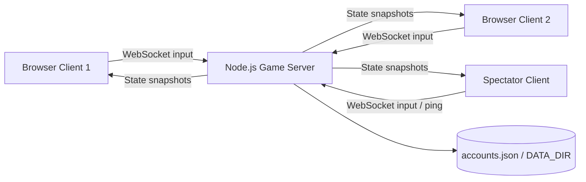
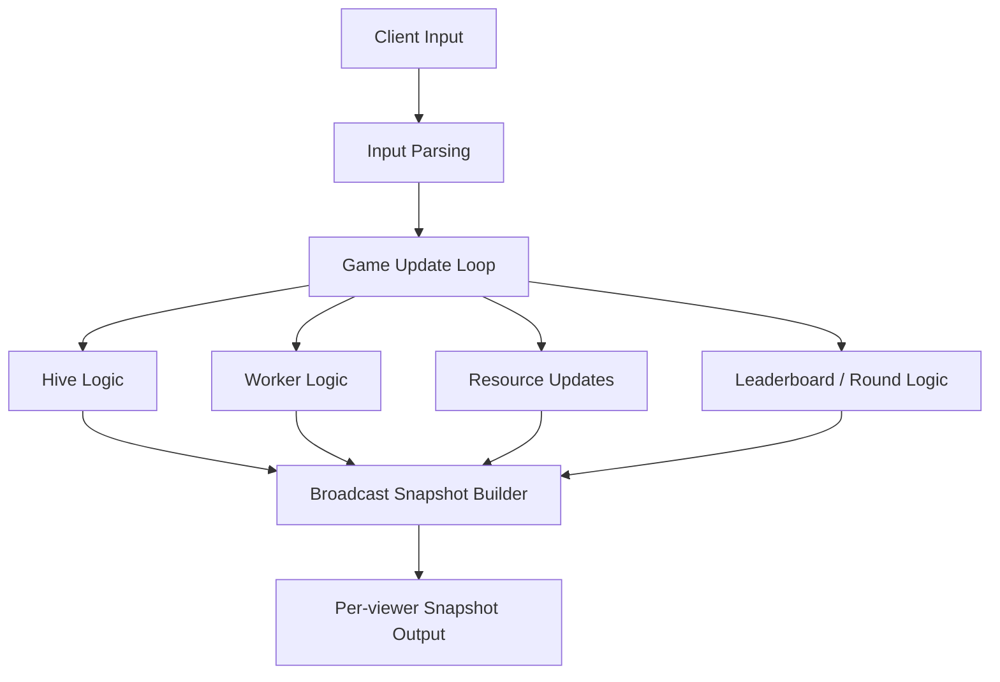

# Colony.io Details

Colony.io is a browser-based real-time multiplayer colony game built with a server-authoritative Node.js backend and a canvas-based frontend. Players control a hive, collect spores, hatch workers, split and merge units, raid enemy colonies, unlock skins, and earn run-based card buffs inside a shared live arena.

This document is the detailed system write-up. It focuses on features, architecture, PDC concepts, performance evidence, and design rationale.

## 1. Project Summary

- **Project name:** `Colony.io`
- **Type:** real-time multiplayer browser game
- **Backend:** `Node.js` + `ws`
- **Frontend:** vanilla `HTML`, `CSS`, `JavaScript`, `Canvas`
- **Persistence:** JSON account store in `data/accounts.json` or `DATA_DIR/accounts.json`
- **Deployment target:** Railway / Docker-compatible hosts

## 2. Core Scope

The system is designed to support:

- up to **30 concurrent live players**
- server-authoritative real-time gameplay
- account login and guest sessions
- persistent progression for accounts
- responsive gameplay across unstable network conditions

## 3. System Features

### 3.1 Major Features

| Feature | What it does | Why it matters |
|---|---|---|
| Real-time multiplayer arena | Multiple players share the same live map and interact at the same time | Core gameplay depends on synchronized shared state |
| Hive and worker control | Players move the hive, direct workers, split, merge, hatch, raid, and harvest | Creates the game’s strategy and skill loop |
| Match-based card buffs | Players choose 1 of 3 cards at key run levels | Adds replayability and run-specific strategy |
| Account system | Registered users keep XP, levels, and skins | Supports progression and retention |
| Guest mode | Fast entry without account creation | Reduces friction for new players |
| Spectator mode | Users can watch ongoing matches | Useful for dead players and observers |
| Network diagnostics | Ping, jitter, snapshot rate, and packet indicators are visible | Helps debug live performance and verify smoothness |
| Persistent storage | Accounts are saved to disk or a mounted Railway volume | Prevents progress loss across restarts |

### 3.2 Feature Visuals

Suggested visuals for the report:

1. Main gameplay screen
2. How To Play panel
3. Card selection overlay
4. Spectator screen
5. Network diagnostics strip

Example markdown image slots:

```md


```

### 3.3 Short Feature Explanations

#### Real-time Arena
Players join the same map and compete for score by harvesting food, eating growth nodes, building workers, and collapsing enemy hives.

#### Worker Command System
Workers act as the player’s distributed units. They can gather, raid, grow, split, and merge depending on player inputs and current mode.

#### Card Buff System
At milestone run levels, the player chooses **1 card from 3 options**. The chosen buff applies to the current run only, keeping matches competitive while still giving progression moments.

#### Spectator System
Players can observe a live match rather than actively controlling a hive. This is useful after death or for multiplayer viewing and testing.

#### Network Smoothness Tooling
The client exposes network indicators such as ping, jitter, snapshot rate, and packet pressure so performance issues can be observed during gameplay rather than guessed.

## 4. Architecture & Design

### 4.1 System Structure



### 4.2 Internal Server Design



### 4.3 Communication Flow

1. The client sends movement and command input to the server through WebSockets.
2. The server validates and stores the latest input for that player.
3. A fixed-timestep game loop updates authoritative world state.
4. A separate broadcast loop packages snapshots for players and spectators.
5. The client interpolates received state to keep rendering smooth.

### 4.4 Data Movement

- **Client → Server**
  - player input
  - ping packets
  - auth requests

- **Server → Client**
  - world snapshots
  - acknowledgements
  - pong timing replies

- **Server → Storage**
  - account creation
  - progression updates
  - session-related persistence

## 5. PDC Concepts Applied

### 5.1 Client-Server Model

**Where applied:** Entire game architecture.

**Role in the system:**  
The browser acts as a client and the Node.js process acts as the central authority. All important game logic runs on the server, and clients receive synchronized state.

**Why appropriate:**  
This avoids trust issues, reduces cheating opportunities, and keeps every player in the same canonical world.

### 5.2 Distributed Participants

**Where applied:** Multiple players and spectators connected from different browsers.

**Role in the system:**  
Each client is a distributed endpoint generating input and receiving updates, while the server coordinates a shared global game state.

**Why appropriate:**  
The game must support many simultaneous participants in different sessions and roles.

### 5.3 Event-Driven Concurrency

**Where applied:** WebSocket handling and HTTP request handling.

**Role in the system:**  
Node.js processes many active sockets and requests concurrently using asynchronous I/O rather than spawning a thread per client.

**Why appropriate:**  
This is efficient for a network-heavy multiplayer game where most waiting time is I/O-bound.

### 5.4 Fixed-Timestep Simulation

**Where applied:** Game-state update loop.

**Role in the system:**  
The server advances simulation at a stable tick rate instead of relying on irregular client timing.

**Why appropriate:**  
It keeps gameplay more deterministic and easier to balance.

### 5.5 Snapshot Broadcasting

**Where applied:** Broadcast loop from server to all viewers.

**Role in the system:**  
The server periodically distributes a consistent view of the world to clients.

**Why appropriate:**  
This supports synchronized multiplayer while allowing the client to smooth rendering visually.

### 5.6 Per-Viewer Culling and Partial State Distribution

**Where applied:** Snapshot generation.

**Role in the system:**  
Each viewer receives only nearby resources and nearby players/workers when possible, instead of the entire world every update.

**Why appropriate:**  
This reduces network load, lowers serialization cost, and improves scalability for a 30-player room.

### 5.7 Heartbeat-Based Fault Detection

**Where applied:** WebSocket connection management.

**Role in the system:**  
The server periodically pings sockets and terminates dead connections that no longer respond.

**Why appropriate:**  
It prevents stale broken connections from consuming memory and harming smooth live play.

### 5.8 Backpressure Awareness

**Where applied:** WebSocket send path and client input path.

**Role in the system:**  
The system checks buffered send pressure before continuing heavy traffic to a slow connection.

**Why appropriate:**  
It reduces queue buildup, lag spikes, and memory pressure under unstable network conditions.

## 6. Performance Evidence

This section presents currently verifiable runtime and implementation evidence from the system. It intentionally avoids inventing benchmark numbers that were not measured.

### 6.1 Measurable Runtime Configuration

| Metric | Current value | Source |
|---|---|---|
| Max concurrent players | `30` | `server.js` |
| Server simulation tick rate | `30 Hz` | `server.js` |
| Snapshot broadcast rate | `24 Hz` | `server.js` |
| Score target per round | `20,000` | `server.js` |
| Input send interval | `33 ms` base with dedupe/heartbeat rules | `public/client.js` |
| WebSocket heartbeat interval | `25,000 ms` | `server.js` |

### 6.2 Performance-Oriented Optimizations Present

| Optimization | Evidence in system | Expected benefit |
|---|---|---|
| Server-authoritative simulation | Game logic runs on server loop | Consistent world state |
| Client interpolation | Render snapshot is smoothed between updates | Less visible jitter |
| Input deduplication | Client avoids sending unchanged input too often | Lower bandwidth and less input spam |
| Snapshot culling | Per-viewer nearby state only | Smaller payloads |
| Resource partial updates | Resources are sent based on visibility and movement | Less wasted traffic |
| Backpressure checks | Buffered socket thresholds are enforced | Better stability under weak connections |
| WebSocket heartbeat | Dead sockets are terminated | Less ghost load |
| Optional `bufferutil` addon | Installed as optional dependency | Faster WebSocket frame processing |

### 6.3 Evidence Available Inside the System

The running game already exposes live indicators that can be used during evaluation:

- Ping
- Jitter
- Snapshot rate
- Packet In
- Packet Out
- Online player count

### 6.4 Suggested Comparison Table for Final Submission

| Scenario | Ping | Jitter | Snap Rate | Packet Out | Notes |
|---|---:|---:|---:|---:|---|
| Idle, 1 player | fill after test | fill after test | fill after test | fill after test | baseline |
| 5 players active | fill after test | fill after test | fill after test | fill after test | moderate load |
| 15 players active | fill after test | fill after test | fill after test | fill after test | heavy match |
| 30 players stress case | fill after test | fill after test | fill after test | fill after test | max-room scenario |

### 6.5 Suggested Graphs

1. Ping vs. player count
2. Snapshot rate vs. player count
3. Server memory usage over time
4. Packet Out pressure before and after network optimization

## 7. Design Rationale

### 7.1 Why This System Was Selected

This system was selected because a real-time multiplayer game is a strong and practical application of distributed computing. It naturally requires:

- multiple independent clients
- continuous network communication
- synchronized shared state
- scalable coordination under load

### 7.2 Why the Server-Authoritative Model Was Chosen

The server-authoritative approach was chosen because it is the safest and most consistent way to manage a competitive live game.

It ensures that:

- the server decides the real outcome of movement and combat
- clients cannot easily fake score or damage
- all players observe the same authoritative world

### 7.3 Why Node.js and WebSockets Were Chosen

Node.js with WebSockets was chosen because the problem is dominated by many small, frequent network events rather than CPU-heavy batch computation.

This combination works well for:

- many concurrent socket connections
- fast event-driven I/O
- low-overhead real-time communication
- simple deployment on Railway or Docker

### 7.4 Why the Frontend Was Kept Lightweight

The frontend uses plain JavaScript and Canvas instead of a heavier UI framework because the game depends more on:

- fast rendering
- direct control over the frame loop
- low browser overhead

### 7.5 Why Visibility Culling and Partial Snapshots Were Necessary

Sending the entire world to every client on every update does not scale cleanly as more players and workers become active.

Per-viewer culling was chosen because it:

- reduces bandwidth
- lowers serialization work
- improves smoothness for all participants
- fits naturally with a map-based game where distant entities are not immediately relevant

### 7.6 Overall Design Philosophy

The overall design favors:

- simple deployment
- strong server control
- practical scalability
- observable performance
- readable implementation over unnecessary complexity

## 8. Local Run Instructions

```powershell
npm.cmd install
npm.cmd start
```

Open:

- `http://localhost:3000` for the game

## 9. Deployment Notes

- `PORT` is environment-driven
- `GET /healthz` is available
- `DATA_DIR` supports mounted persistent storage
- Railway is the recommended first deployment target

For Railway persistence:

1. mount a volume at `/data`
2. set `DATA_DIR=/data`

Without that, account progress is not guaranteed to survive redeploys.
